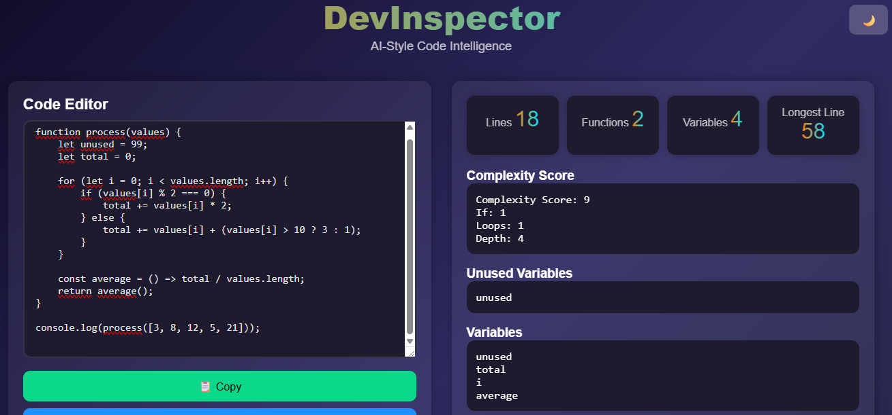

# 🧪 DevInspector  

DevInspector is a modern code inspection interface designed to help developers analyze their code quickly, cleanly, and intuitively.  
It is a lightweight, fast, and visually polished tool built entirely with **HTML + CSS + JavaScript**.

---

## ✨ Features

- 🔍 **Line Count Detection**  
  Instantly counts the total number of lines in the code.

- 🧠 **Function Detection**  
  Automatically lists all declared functions in the input.

- 🎯 **Variable Extraction**  
  Identifies variables defined with `let`, `const`, and `var`.

- ⚠️ **Unused Variable Detection**  
  Shows variables that are declared but never used.

- 📏 **Longest Line Analysis**  
  Detects the longest line of code and its character length.

- 🎨 **Built-in Syntax Highlighting**  
  Highlights syntax using a custom highlighter with zero external libraries.

- 📦 **Export as JSON**  
  Easily export the analysis results in JSON format.

- 🌓 **Theme Switcher (Dark/Light)**  
  Toggle between dark and light themes with a single button.

---

## 🖥 Interface (UI)

DevInspector provides a clean, minimal, and professional user experience.  
The layout consists of two main panels:

- **Left Panel:** Code editor  
- **Right Panel:** Analysis results (lines, variables, functions, complexity, etc.)

---

## Screenshots

---

## 🚀 Installation

git clone https://github.com/<username>/devinspector.git
cd devinspector
open index.html   # macOS
start index.html  # Windows

---

## 🧰 Project Structure

devinspector/
│
├── index.html      # Main interface
├── styles.css      # Layout, design, and themes
├── script.js       # Code analysis engine
└── highlight.js    # Syntax highlighting engine

---

## 📄 License

MIT License  
Free for personal and commercial use.

---

## ⭐ Support

If you like the project, consider leaving a ⭐ star on the repository.

---

💡 DevInspector — Simple, fast, and clean code analysis.

